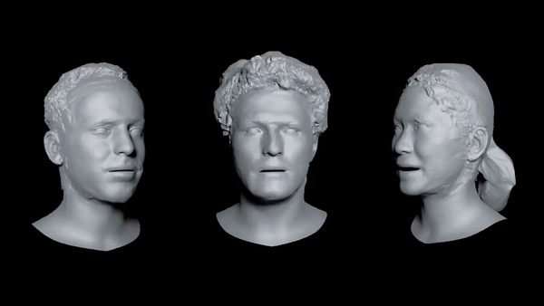
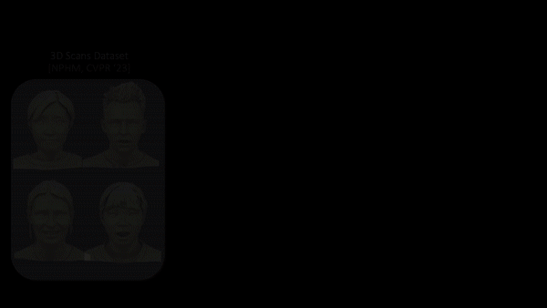

# HeadCraft: Modeling High-Detail Shape Variations for Animated 3DMMs

### 3DV 2025



[**Paper**](https://arxiv.org/abs/2312.14140) | [**Project Page**](https://seva100.github.io/headcraft) | [**Video**](https://youtu.be/uBeBT2f1CL0)


The repository contains the training and inference code for the paper "HeadCraft: Modeling High-Detail Shape Variations for Animated 3DMMs". The code corresponds to the latest (second) version released on arXiv (same as the version accepted at 3DV 2025).

If you've found this code or some of its parts useful, please consider citing the following reference:

```   
@article{sevastopolsky2023headcraft,
  title={HeadCraft: Modeling High-Detail Shape Variations for Animated 3DMMs},
  author={Sevastopolsky, Artem and Grassal, Philip-William and Giebenhain, Simon and Athar, Shah{R}ukh and Verdoliva, Luisa and Nie{\ss}ner, Matthias},
  publisher={arXiv preprint arXiv:2312.14140},
  primaryClass={cs.CV},
  year={2023}
}         
```

The implementation consists of two parts: the first part is for the registration of FLAME+displacement with 3D scans (`headcraft/registration/`) and the second part is for the training (guidelines provided below) and inference of StyleGAN (`headcraft/generation/`).



## Installation

To clone the repository with a StyleGAN submodule, execute the following command:

```bash
git clone --recursive https://github.com/seva100/headcraft.git
```

The script below creates a Conda environment with Python==3.9. The core packages to install are PyTorch 2.* and PyTorch3D (e.g. 0.7.5). 

```bash
bash setup.sh

# in case of the successful installation, do:
conda activate headcraft
```

The created environment should also work for training the StyleGAN model on the HeadCraft registrations with [stylegan2-ada-lightning](https://github.com/nihalsid/stylegan2-ada-lightning) repo included as a submodule. 

The StyleGAN submodule requires several changes to make it compatible with this repository. To apply these changes, execute the following commands:

```bash
cp stylegan_changes/trainer/train_stylegan.py stylegan2-ada-lightning/trainer/train_stylegan.py
cp stylegan_changes/config/stylegan2.yaml stylegan2-ada-lightning/config/stylegan2.yaml 
cp stylegan_changes/model/generator.py stylegan2-ada-lightning/model/generator.py 
```

We attach the minimal FLAME implementation in `headcraft/modules/flame`. To be able to use it, please register at `https://flame.is.tue.mpg.de/` and sign the FLAME license agreement. 

## Inference

Please download the pretrained HeadCraft model from [here](https://drive.google.com/drive/folders/15FAoC3bFeuDpUCJoTkwen46LZPRp-35f?usp=sharing) and extract it to `checkpoints/`.

To generate samples from the training set, run the following command. The samples will be added to randomly generated FLAME templates.

```bash
python headcraft/generation/generate_samples.py \
    --ckpt_path <path to the checkpoint> \
    --ckpt_path_ema <path to the checkpoint with exp moving average (recommended); --ckpt_path also needs to be provided in this case, but EMA one will be used> \
    --output_path <path to the output directory> \
    --num_samples <number of samples to generate> \
    [--to_3d]
    [--sample_flame]
    [--save_flame]
```

Example with the downloaded models:
```bash
python headcraft/generation/generate_samples.py \
    --ckpt_path checkpoints/_epoch=9.ckpt \
    --ckpt_path_ema checkpoints/ema_000095671.pth \
    --output_path out_ckpt \
    --num_samples 20 \
    --to_3d \
    --seed 42
```

<!-- Another script fits the latent to either full UV map:

```bash
python headcraft/generation/fit_latent.py \
    --input_flame_path <path to the input flame ply> \
    --input_uvmap_path <path to the input UV map in uint16 or npy> \
    --checkpoint_path <path to the checkpoint> \
    --output_path <path to the output directory> \
    --num_samples <number of samples to generate> \
    --uv_path <path to the UV map>
```

or a partial UV map (could be e.g. regressed from a depth scan):
```bash
python headcraft/generation/fit_latent_to_partial.py \
    --input_flame_path <path to the input flame ply> \
    --input_uvmap_path <path to the input UV map in uint16 or npy> \
    --input_uvmask_path <path to the input UV mask in png> \
    --checkpoint_path <path to the checkpoint> \
    --output_path <path to the output directory> \
    --num_samples <number of samples to generate> \
    --uv_path <path to the UV map>
``` -->

<!-- The displacements can be applied to the template being animated. The following script generates a video with the animation of the template:

```bash
python headcraft/generation/animate.py \
    --template_flame_params <path to the input flame params as .npz, only shape is important> \
    --sequence_flame_params <path to the input flame params as .npz, all components except shape are important> \
    --input_uvmap_path <path to the input UV map in uint16 or npy> \
    --checkpoint_path <path to the checkpoint> \
    --output_path <path to the output directory> \
    --num_samples <number of samples to generate> \
    --uv_path <path to the UV map>
``` -->

## Training

We train HeadCraft on UV maps of displacements for the FLAME template. The UV maps are constructed for a set of 3D scans. In particular, we used [NPHM dataset](https://github.com/SimonGiebenhain/NPHM/blob/main/dataset/README.md). Please download the dataset by accepting the license agreement and extract the scans into a folder `dataset`. The provided code could also be applied to other datasets such as [FaceVerse](https://github.com/LizhenWangT/FaceVerse-Dataset/) -- the only data required would be the 3D scans (+ 3D landmarks for FLAME fitting) for each of them; also, they must be aligned with the FLAME coordinate system and typical placement of FLAME models, scaled 4x (NPHM convention). Our working coordinate system is the same as NPHM convention but the heads are scaled 30x relative to that (i.e. 120x w.r.t. to the standard FLAME scale).

We assume that FLAME has been prefitted to each of the scans.
For NPHM scans, we provide the processed registrations at [the link](https://drive.google.com/drive/folders/1vMq4GeHlSq7ycYSzPxdCTF4n8tY7jt_M?usp=sharing) (please sign the NPHM license agreement before downloading). This includes: 

* FLAME fits (`flame.ply` files)
* Triangles after subdivision (`faces.npy`)
* UVs after subdivision (`uvs.npy`)
* Registered meshes (full mesh: `template_upd.ply`; vertices alone: `ver_upd.npy`)
* UV maps of displacements (`uv_map_offset_custom_layout3.npy_-20_to_20_ch*.png`)

The registrations are only provided for the "000" expression of each subject due to the large files size. 

In case you want to modify/recreate the registrations, adapt it for your own dataset or process the whole NPHM with all expressions, please follow the Registration instructions below.

### Registration

The registration is performed in several steps, specified below. We'll use NPHM dataset as an example but the same steps can be applied to other datasets.

1. We assume FLAME to be fitted to each of the scans.
2. Subdivide each ground truth mesh in the NPHM dataset (`headcraft/registration/subdiv_flame.py`).
3. Regress vector displacements (`headcraft/registration/estimate_vector_offsets.py`).
4. Regress normal displacements. (`headcraft/registration/subdiv_flame.py`)
5. Bake the resulting displacements into UV maps (`headcraft/registration/save_uv_map.py`).

We also provide the script `headcraft/registration/process_scans.py` that comprises all these steps.

See registration [README](headcraft/registration/README.md) for precise commands for running these scripts. 

### Generation

Training of the generative model is done with the `stylegan2-ada-lightning` repo included as a submodule. After applying the changes from `stylegan_changes` folder (see above), a config with appropriate parameters will be saved in `stylegan2-ada-lightning/config/stylegan2.yaml`. The remaining parameters to adjust are `dataset_path` and `save_dir`. Then, training can be started with

```bash
cd stylegan-ada-lightning
CUDA_HOME=<your cuda location> python trainer/train_stylegan.py
```

See [stylegan2-ada-lightning](https://github.com/nihalsid/stylegan2-ada-lightning) for more detail.
